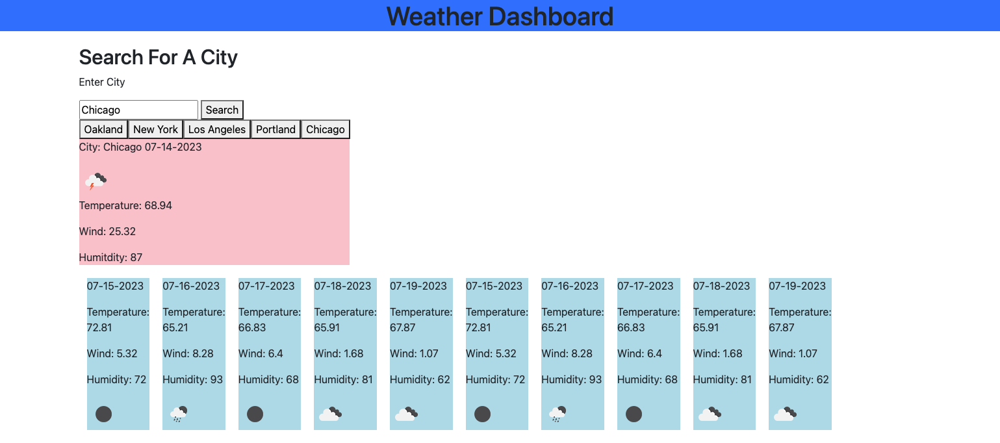

# Weather-Dashboard

## Technology Used

| Technology Used         | Resource URL           | 
| ------------- |:-------------:| 
| HTML    | [https://developer.mozilla.org/en-US/docs/Web/HTML](https://developer.mozilla.org/en-US/docs/Web/HTML) | 
| CSS     | [https://developer.mozilla.org/en-US/docs/Web/CSS](https://developer.mozilla.org/en-US/docs/Web/CSS)      |   
| Git | [https://git-scm.com/](https://git-scm.com/)     |    
| JavaScript | [https://developer.mozilla.org/en-US/docs/Web/JavaScript](https://developer.mozilla.org/en-US/docs/Web/JavaScript)

## Description

[Visit the Deployed Site Here!]( https://thomasmunzar.github.io/Weather-Dashboard/)

The goal of this project was to use a weather API to create a weather app.  The user can go to the webpage and enter a city in the United States and they will get information containing: Current weather with the wind/humidity/temerature and an icon depicting the weather. In addition to the current weather there is also a 5 day forecast that is shown on the webpage as well. Using API's opens a site to an infinite amount of information.  Once a developer finds a API that they would like to impliment they must go through its information in their console on the browser. You can learn to extract exact information from a huge "library" and make your user find specific information from this api database.

Here is a screenshot of my final page



## Learning-Points

This assignment was extremely challenging for me. Just trying to figure out what function to start with took me forever. I am getting a bit more confident writing functions but for the most part I feel like each line of code for me is a ton of reasearch and help from my tutor. 

After talking wiht my tutor, I came to the conclusion that this whole page really starts with a click from the user on the search button. So the function i wanted to start with was with-in my eventListener.

Part of the code that really started to make sense to me was displaying the information from the API to the webpage based on the reuired information for this project.

```S

        recentSearches(city)
        var latLonApi = "https://api.openweathermap.org/data/2.5/weather?q="+ city +"&appid="+ myApiKey + "&units=imperial";
        fetch(latLonApi)

    .then(function(response){
    return response.json();
    })
    .then(function(data){
    console.log(data);
    $("#city").text("City: "+ city+" "+dayjs.unix(data.dt).format("MM-DD-YYYY"))
    $("#weatherImage").attr("src","https://openweathermap.org/img/wn/"+ data.weather[0].icon+".png")
    $("#temp").text("Temperature: "+data.main.temp)
    $("#wind").text("Wind: "+ data.wind.speed)
    $("#humitdity").text("Humitdity: "+data.main.humidity)
    fiveDayForecast()
    })

```
I used jquery to select my ID's and adding Text to those areas on my page. I then looked through the API in my console using Chrome Dev Tools and wrote the path to the infor (data.main.temp) was the path to temperature. This was really cool to me and is helping understand API's a bit better. I still struggle with the syntax of javascript but once i got on the right path to start the functions for this project, it was just a matter of researching to get to my next move.

## Author Info

### Thomas Munzar

* [Portfolio](https://thomasmunzar.github.io/portfolio-thomas/)
* [LinkedIn](https://www.linkedin.com/in/thomas-munzar-659b51250/)
* [Github](https://github.com/ThomasMunzar)

##
Thank you to my fellow classmates, teachers, TA's, Tutors for helping me and creating a supportive community.

## License
MIT License

Copyright (c) [2023] [Thomas Munzar]

Permission is hereby granted, free of charge, to any person obtaining a copy
of this software and associated documentation files (the "Software"), to deal
in the Software without restriction, including without limitation the rights
to use, copy, modify, merge, publish, distribute, sublicense, and/or sell
copies of the Software, and to permit persons to whom the Software is
furnished to do so, subject to the following conditions:

The above copyright notice and this permission notice shall be included in all
copies or substantial portions of the Software.

THE SOFTWARE IS PROVIDED "AS IS", WITHOUT WARRANTY OF ANY KIND, EXPRESS OR
IMPLIED, INCLUDING BUT NOT LIMITED TO THE WARRANTIES OF MERCHANTABILITY,
FITNESS FOR A PARTICULAR PURPOSE AND NONINFRINGEMENT. IN NO EVENT SHALL THE
AUTHORS OR COPYRIGHT HOLDERS BE LIABLE FOR ANY CLAIM, DAMAGES OR OTHER
LIABILITY, WHETHER IN AN ACTION OF CONTRACT, TORT OR OTHERWISE, ARISING FROM,
OUT OF OR IN CONNECTION WITH THE SOFTWARE OR THE USE OR OTHER DEALINGS IN THE
SOFTWARE.


